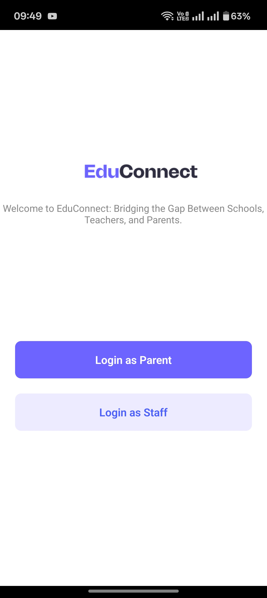

# 🎓 EduManage – Flutter UI Project

A **Flutter** project designed to explore UI development by building a student management app. 
---

## 📱 Screenshots

<div align="center">
  <table>
    <tr>
      <td></td>
      <td></td>
      <td></td>
    </tr>
    <tr>
      <td></td>
      <td></td>
      <td></td>
    </tr>
  </table>
</div>

---

## 🚀 Getting Started

### Prerequisites

- [Flutter SDK](https://docs.flutter.dev/get-started/install) (v3.10 or newer)
- Android Studio or Xcode (with emulator or real device setup)
- Dart (bundled with Flutter)
- IDE (VS Code or Android Studio recommended)

---

### Installation

```bash
git clone https://github.com/shivamsharma-1996/EduManage-Flutter.git
cd EduManage-Flutter
flutter pub get
